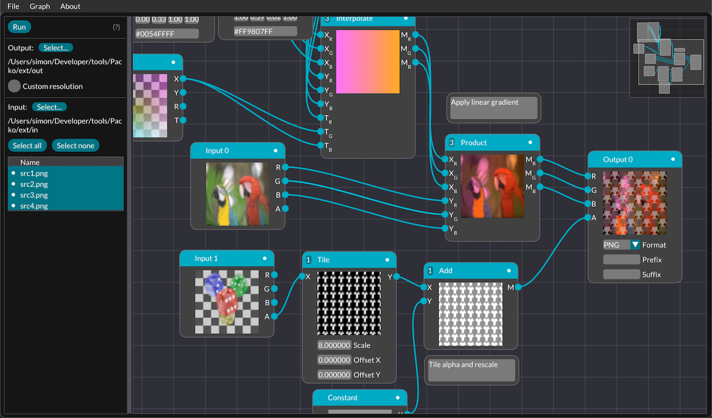
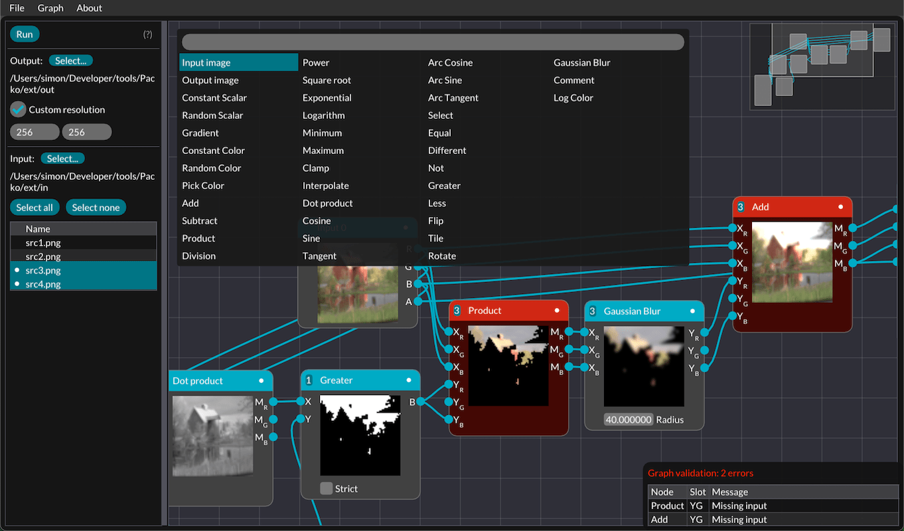

# Packo

Packo is a nodal editor for image processing, designed to easily mix and combine images and perform operations on their channels. It can be used in computer graphics to compress and pack data, experiment with postprocessing stacks,... Packo can apply a graph to multiple batches of input images and adjust the outputs size and naming.

## Features

* Nodes
	- Maths: standard operations and functions, trigonometry, interpolation
	- Booleans: comparisons, selection between two inputs
	- Generation: constant colors, random noise
	- Global operations: tiling, mirroring, rotation, gaussian blur
	- Comments
* Interactive error report when validating a graph before execution
* Export and import of graphs
* Palette to search and insert new nodes
* List of input images to process
* Live preview of all node intermediate results
* Adjustable number of channels for each node
* Shortcuts to ease creation/deletion of multiple connections at once and connections to constant values

## Future improvements

* Handling of images with different sizes
* Improve global nodes computation speed
* More nodes (Perlin,...)
* HDR support

